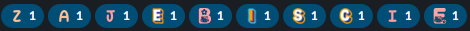

# slack-reactions

## How to use

1. Get a token as instructed here https://stackoverflow.com/a/67795540/7195666
2. Create `.env` file with `TOKEN=your-token`
3. Add `ALPHABETS` to `.env` (see Prerequisites)
3. `npm install`
4. `node index.js <channel-id> <string> <text of reactions>`

string: should be a string that appears in the message you want to react to and no later message.

## Prerequisites

This code assumes you have at least one emoji alphabet in your slack and that to distinguish between letter the letter is in the name of the emoji. Example formats: :whatever-alphabet-a: (a), :b-letter-3: (b), :asd-x-asd: (x).

You need to put the `ALPHABETS` in the `.env` file. This should be a comma separated list with `$` in place of the letter. For the example formats: `ALPHABETS=whatever-alphabet-$,$-letter-3,asd-$-asd`.

In order to be albe to react with "sentences" with more than `X` occurences of a letter, you need to have more than `X` alphabets, since the reaction cannot repeat.

### Random order of alphabets

By default the script will use the alphabets in the order they are in the `ALPHABETS` variable. If you want to use them in a random order, you can add `RANDOM=1` to the `.env` file.
